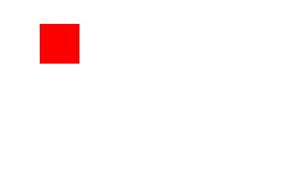
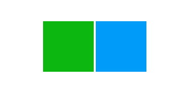
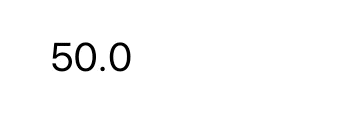
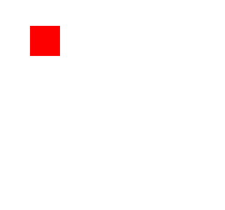
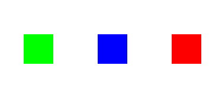
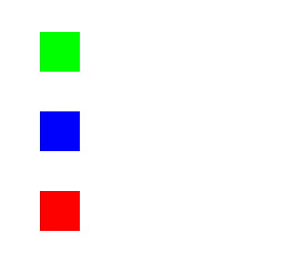
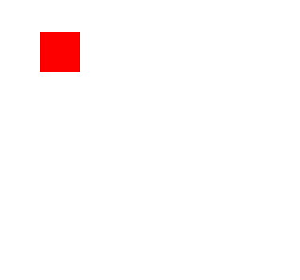

[](https://travis-ci.org/Nicholas Shipes/Kinetic)
[](http://cocoapods.org/pods/Kinetic)
[](http://cocoapods.org/pods/Kinetic)
[](http://cocoapods.org/pods/Kinetic)

Kinetic
======
A flexible tweening library for iOS in Swift2 similar to [GSAP](http://greensock.com/gsap) and inspired by [Cheetah](https://github.com/suguru/Cheetah).

Requirements
----
- iOS 8.0+
- Swift 2.2+
- Xcode 7.3+

## Usage

To run the example project, clone the repo, open the `Kinetic.xcworkspace` and run the *Kinetic-Example* project.

## Installation

- **CocoaPods**: add `pod "Kinetic"` to your `Podfile`

- **Carthage**: add `github "u10int/Kinetic" "master"` to your `Cartfile`

Features
----
- Quickly setup animations in a syntax similar to TweenMax, TimelineMax and the awesome [GSAP](http://greensock.com/gsap)
- Start, stop, pause and resume any animation during runtime
- Easings and springs for more realistic and interesting animations
- Chaining methods for concise code
- Support for animating from, animating to, or animating from and to specific values (`to:`, `from:`)
- Animate multiple objects sequentially, in parallel or staggered in a single animation group
- Advanced animations using timelines to insert gaps, callbacks and more during an animation
- Support for animating any NSObject property on your custom objects

## Roadmap

- Improve and cleanup API
- Support for animating elements along a UIBezierPath
- Support for animating SVG drawings
- Support for animating text and characters

## Author

* [Nicholas Shipes](https://github.com/u10int) ([@u10int](https://twitter.com/u10int))

## License

Kinetic is available under the MIT license. See the LICENSE file for more info.


Basic Examples
----
Animating multiple properties of an UIView or CALayer can be done in a single line of code:

```swift
let square = UIView()
square.frame = CGRectMake(50, 50, 50, 50)
square.backgroundColor = UIColor.redColor()
view.addSubview(square)

// move 250pt to the right and set the height to 100pt for 0.5 seconds
Kinetic.animate(square).to(.X(250), .Height(100)).duration(0.5).ease(Easing.inOutQuart).play()
```



Animating the same properties on multiple objects is just as quick and easy:

```swift
let greenSquare = UIView()
greenSquare.frame = CGRectMake(0, 50, 100, 100)
greenSquare.backgroundColor = UIColor(red: 0.0557, green: 0.7144, blue: 0.0677, alpha: 1.0)
view.addSubview(greenSquare)

let blueSquare = UIView()
blueSquare.frame = CGRectMake(0, 50, 100, 100)
blueSquare.backgroundColor = UIColor(red: 0.0, green: 0.6126, blue: 0.9743, alpha: 1.0)
view.addSubview(blueSquare)

// rotate the views and repeat 3 times in a back and forth (yoyo) motion
let timeline = Kinetic.animateAll([greenSquare, blueSquare]).to(.RotateXY(0, CGFloat(M_PI_2))).duration(1)
timeline.ease(Easing.inOutSine).perspective(1 / -1000).yoyo().repeatCount(3)
timeline.play()
```



Review the example project for more in-depth and complex animation examples using Kinetic.

Supported Properties
----
Kinetic has support for animating most visible properties on UIView and CALayer already built-in, but you can also animating any custom key-value property on NSObject:

- `.Position(xVal, yVal)`, `.X(xVal)`, `.Y(yVal)` - animates the frame's origin of the view or layer
- `.Center(xVal, yVal)`, `.CenterX(xVal)`, `.CenterY(yVal)` - animates the frame's center of the view or layer
- `.Shift(xOffset, yOffset)` - shifts the frame's current origin by the specified x and y distances (similar to translate but changes the object's origin value instead of using `transform`)
- `.Width(val)`, `.Height(val)`, `.Size(width, height)` - animates the frame's size of the view or layer
- `.Alpha(val)` - animates the object's opacity
- `.Translate(xOffset, yOffset)` - shifts the frame's position by the specified x and y distances using the layer's `transform` property
- `.Scale(val)` - animates the scale of the object equally for all axes (x, y and z)
- `.ScaleXY(scaleX, scaleY)` - animates the scale of the object in the x and y axes
- `.Rotate(val)` - animates the rotation of the object two-dimensionally in the z axes
- `.RotateX(rotateX)` - animates the rotation of the object in the x axes (for three-dimensional rotation)
- `.RotateY(rotateY)` - animates the rotation of the object in the y axes (for three-dimensional rotation)
- `.BackgroundColor(color)` - animates the background color of the view or layer
- `.KeyPath(key, val)` - animates a custom property on an NSObject instance for the specified key path

The animation properties you provide with your tweens use a very Swift-like syntax where you specify the starting or ending values as parameters to the property you wish to animate. For example, to animate a view's origin.x from its current position to 100pt you would use `.X(100)`. However, if you just wanted to shift the view from its current location 100pt to the right, you would use `.Shift(100,0)` instead, which specifies the distance to move the view in both x and y coordinates.

Classes
----
The following are the primary classes used within the library along with their purpose.

| Class         | Description                                                                                                                                               |
|---------------|-----------------------------------------------------------------------------------------------------------------------------------------------------------|
| Kinetic       | Central class providing convenience static methods for creating tweens, timelines and removing them.                                                      |
| Tween         | Primary class used for animating individual objects and multiple properties.                                                                              |
| Timeline      | Used for combining multiple tweens into a single group with support for playing animations at specific times and inserting gaps along the timeline.       |
| Animation     | Internal base class for Tween and Timeline that provides common properties and methods.                                                                   |
| TweenProperty | Internal classes that represent a single animatable property for an object and performs the necessary calculations and updates during animation playback. |
| Easing        | Common easing properties for animations.                                                                                                                  |
| Spring        | Basic spring for physics-based animations.                                                                                                                |

Controlling Tweens
----
Once you have an instance of a Tween using `Kinetic.animate:` or Timeline using `Kinetic.animateAll:`, controlling your animation during playback is extremely simple.

You can configure your tween before playback to define its delay, easing or spring, repeat count, or repeat forever:

```swift
// sets the initial state of the animation before playback, where `...` is a series of `Property` instances
tween.from(...)

// sets the final state of the animation when playback completes, where `...` is a series of `Property` instances
tween.to(...)

// total duration of the animation, in seconds, not including any delay value
tween.duration(0.5)

// wait 2 seconds before starting the animation
tween.delay(2)

// set the easing to use for the animation, which will be used for all properties in the tween
tween.ease(Easing.inOutQuart)

// configure the tween to use a spring animation, which will be used instead of any easing previously set
tween.spring(tension: 100, friction: 12)

// tell the tween to repeat 4 additional times, meaning it will play a total of 5 times
tween.repeatCount(4)

// set a delay of 0.5 seconds between repeats
tween.repeatDelay(0.5)

// tell the tween to repeat forever until stopped using stop() or pause()
tween.forever()

// reverses the direction of playback each time the tween is repeated
// if the tween is configured to repeat 4 times, then the animation will play with the pattern: forward, reversed, forward, reversed, forward.
tween.yoyo()

// set the transform perspective for the tween's associated object
// this is only used for three-dimensional CALayer transformation
tween.perspective(1 / -1000)
```

Once you've configured your tween and started its playback using `play()`, you can stop, pause, resume, seek, reverse, or restart a tween at any time:

```swift
// plays the tween from the beginning
tween.play()

// stops the tween at the current position
tween.pause()

// resumes playback from the tween's current position
tween.resume()

// reverses playback direction toward the beginning
tween.reverse()

// returns playback direction to the normal direction
tween.forward()

// restarts the tween from the beginning
tween.restart()

// jump to 0.5 seconds into the tween
tween.seek(0.5)

// immediately stop and remove the tween from the object
tween.kill()

// get the current progress of the tween from 0 (start) to 1 (end); doesn't account for repeats (a single animation cycle)
tween.progress()

// move the animation's playhead progress from 0 (start) to 1 (end) excluding repeats and repeatDelays (a single animation cycle)
tween.setProgress(progress: Float)

// get the current progress of the tween from 0 (start) to 1 (end) including repeats and repeatDelays
tween.totalProgress()

// move the animation's playhead progress from 0 (start) to 1 (end) including repeats and repeatDelays
tween.setTotalProgress(progress: Float)

// get the total elapsed time of the tween including any repeats and delays
tween.time()
```

You can also remove multiple tweens of a single object by using the convenience methods provided by the central Kinetic module:

```swift
Kinetic.killTweensOf(square)
```

To remove all tweens currently running from all objects, simply call `killAll()`:

```swift
Kinetic.killAll(greenSquare)
```

Killing and removing a tween is similar to `pause()` and will stop the animation at its current position without returning the associated object back to its original starting position. The tween will also be disassociated from the object and removed from the tween cache.

###Callbacks###

You can assign callback blocks for several events during a tween's playback, including when it starts, when it updates an object's properties, when it repeats and when it completes. The Tween instance that called the block will be provided as an argument to your block:

```swift
// called when the tween starts animating
tween.onStart { (tween) -> Void in
	print("tween started")
}

// called when the tween's properties are updated during the animation
tween.onUpdate { (tween) -> Void in
	print("tween updated: time=\(tween.elapsed)")
}

// called each time the tween repeats
// if the tween's playback is reversed, this will be called when the tween's position reaches the beginning
// of the tween, or 0, instead of the end
tween.onRepeat { (tween) -> Void in
	print("tween repeated")
}

// called when all properties of the tween have finished animating to their final values
tween.onComplete { (tween) -> Void in
	print("tween completed")
}
```

Custom Properties
----
Most of the time you'll be animating UIView and CALayer instances and their visual properties. However, you may also need to animate a different property not supported with Kinetic's standard property set or a property of a custom object in your project. You can accomplish this using the `KeyPath(key, val)` property with a Tween.

A good use case for this is to setup a UILabel that animates a value change, such as from 50 to 250. With a Tween instance and the `KeyPath()` property, this is just as easy as any other animation:

```swift
let textLabel = UILabel()
textLabel.font = UIFont.systemFontOfSize(40)
textLabel.textColor = UIColor.blackColor()
textLabel.frame = CGRect(x: 50, y: 50, width: 200, height: 50)
view.addSubview(textLabel)

// our custom object
let testObject = TestObject()

// set the initial value of our property, which will be the starting value of the counting animation
testObject.value = 50
textLabel.text = "\(round(testObject.value))"

let increment = Kinetic.animate(testObject).to(.KeyPath("value", 250)).duration(1)
increment.ease(Easing.outQuart).onUpdate { () -> Void in
	textLabel.text = "\(round(testObject.value))"
}.onComplete({ () -> Void in
	textLabel.text = "\(round(testObject.value))"
}).play()
```



Any custom property can be used as long as it's a property of an NSObject and the property has a numerical value.

Timelines
----
A Kinetic Timeline allows you to group multiple Tween instances into a single, easy to control sequence with precise timing management for more complex animations. Without using a Timeline instance, you would have to create multiple Tween instances and manually calculate their delay values to create the exact sequence you want.

###Serial Animations###

In many cases, you'll want to perform a serial, or sequential, animation on a single or multiple objects where each tween is performed one after another. For instance, if you want to move a view to the right, then down, and then scale it up by 2 for a duration of 3 seconds, you could do so by creating three Tween instances and offset their delay values by 1 second:

```swift
Kinetic.animate(square).to(.X(110)).duration(1).ease(Easing.inOutCubic).play()
Kinetic.animate(square).to(.Y(250)).duration(1).ease(Easing.inOutCubic).delay(1).play()
Kinetic.animate(square).to(.Scale(2)).duration(1).ease(Easing.inOutCubic).delay(2).play()
```

Note that if you change the duration of any of the individual tweens, you also have to be sure to adjust the delay values for the sequence. And trying to pause, restart or reverse the sequence is even more of a challenge. However, by using a Timeline instance you can perform all of these functions easily:

```swift
let timeline = Timeline()
timeline.add(Tween(target: square).to(.X(110)).duration(1).ease(Easing.inOutCubic))
timeline.add(Tween(target: square).to(.Y(250)).duration(1).ease(Easing.inOutCubic))
timeline.add(Tween(target: square).to(.Scale(2)).duration(1).ease(Easing.inOutCubic))
timeline.play()
```



The above timeline will perform each tween sequentially for a total duration of 3 seconds since each tween is 1 second in length.

Instead of having each tween play one after another, you can specify a position for one or all of the tweens in your sequence. For example, we want to play the second tween in the above sequence at 1.5 seconds into the timeline instead of immediately after the first one completes:

```swift
let timeline = Timeline()
timeline.add(Tween(target: square).to(.X(110)).duration(1).ease(Easing.inOutCubic))
timeline.add(Tween(target: square).to(.Y(250)).duration(1).ease(Easing.inOutCubic), position: 1.5)
timeline.add(Tween(target: square).to(.Scale(2)).duration(1).ease(Easing.inOutCubic))
timeline.play()
```

This change will play the second tween at 1.5 seconds into the animation, and then the last one immediately after it completes at 2.5 seconds. Therefore, our timeline's new total duration will be 3.5 seconds instead of 3 seconds.


###Grouped + Staggered Animations###

Using `Kinetic.animateAll` you can animate the same properties on multiple objects using a single line of code. For example, you have 3 square views you want to scale up and rotate 45 degrees at the same time:

```swift
let squares = [greenSquare, blueSquare, redSquare]
let timeline = Kinetic.animateAll(squares).to(.Scale(2), .Rotate(CGFloat(M_PI_2))).duration(1).ease(Easing.inOutSine)
timeline.play()
```



Using a Timeline also provides you with the ability to stagger multiple animations for more interesting effects. For instance, you may have a column of horizontal bars whose widths you want to animate to their final state. You could do this with a basic Timeline instance and increasingly offset their positions relative to the start time, but there's an easier way using `stagger:` on your `Timeline` instance:

```swift
let squares = [greenSquare, blueSquare, redSquare]
let timeline = Kinetic.animateAll(squares).to(.Width(250)).duration(1).stagger(0.08).spring(tension: 100, friction: 12)
timeline.play()
```

In a single line, you can animate each item in `squares` from their starting width to a width of 200 using a spring, each offset by 0.08 seconds.



The method `Kinetic.animateAll:` will return an instance of Timeline.

You can also add labels to your timeline to be used for referencing when adding additional tweens or for playback. For example, you may want to include a color change animation for a view in your timeline and want other tweens to take place relative to that position. First create a label at the time you want to reference and then add your tweens relative to or offset from that label:

```swift
let resize = Kinetic.animate(square).to(.Size(150,100)).duration(1).ease(Easing.inOutCubic)
let color = Kinetic.animate(square).to(.BackgroundColor(UIColor.blueColor())).duration(0.75)

timeline.addLabel("colorChange", position: 1.3)
timeline.add(color, relativeToLabel: "colorChange", offset: 0)
timeline.add(resize, relativeToLabel: "colorChange", offset: 0.5)
```

###Time Labels###

You can add any number of time labels to a timeline that can then be used as reference points for specific positions along the timeline. Once a label has been set, you can add tweens to the timeline relative to a specific label using an offset value. Negative offset values will insert the tween that number of seconds before the label:

```swift
// use a label to store a position reference when the color change still start animating
timeline.addLabel("colorChange", position: 1.3)

// add the color change tween to the timeline relative to our "colorChange" label
let color = Kinetic.animate(square).to(.BackgroundColor(UIColor.blueColor())).duration(0.75)
timeline.add(color, relativeToLabel: "colorChange", offset: 0)

// resize the view 1 second after the color change starts
let resize = Kinetic.animate(square).to(.Size(150,100)).duration(1).ease(Easing.inOutCubic)
timeline.add(resize, relativeToLabel: "colorChange", offset: 0.5)

// move the view 0.25 seconds before the color change starts
let move = Kinetic.animate(square).to(.Position(200,200)).duration(1).ease(Easing.inOutCubic)
timeline.add(move, relativeToLabel: "colorChange", offset: -0.25)

timeline.play()
```



###Time Callbacks##

With timelines you can also insert callback blocks at any time within a timeline's total duration, which is useful if you want to perform a certain action while the timeline is playing or perform another animation:

```swift
timeline.addCallback(Float(idx) * 0.15 + 1.5, block: {
	Kinetic.animate(dot).to(.FillColor(UIColor.orangeColor()).duration(0.5).play()
})
```


###Controlling Timelines###

Timelines support the same methods as tweens for controlling their playback, such as `pause()`, `stop()`, `resume()`, `restart()`, and `seek()`. However, timelines also come with a few more since they support inserting labels at specific times. You can stop at or start playing from a specific label you have previously set on a timeline using `goToAndPlay()` and `goToAndStop()`:

```swift
timeline.addLabel("colorChange", 0.7)
timeline.play()
...
timeline.goToAndStop("colorChange")
```

If the specified label doesn't exist on the timeline, then the timeline will play from or start at the beginning of the timeline.

Timelines also support the same callback blocks as tweens, so you can use `onStart()`, `onUpdate()`, `onRepeat()` and `onComplete()` for timeline instances as well. You can also have callbacks for individual tween instances within a timeline in conjunction with callbacks on the parent timeline if you want to be notified when a particular tween has started or completed.

Refer to the example project for more detailed examples of using a Timeline.

